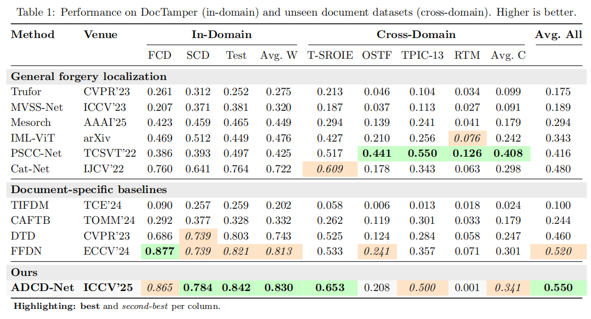

# [ICCV'25] ADCD-Net: Robust Document Image Forgery Localization via Adaptive DCT Feature and Hierarchical Content Disentanglement

[](https://arxiv.org/abs/2507.16397)

## Description   

The official source code of the paper "ADCD-Net: Robust Document Image Forgery Localization via Adaptive DCT Feature and Hierarchical Content Disentanglement". 


We present a robust document forgery localization model that adaptively leverages RGB/DCT forensic traces and incorporates key document image traits. To counter DCT traces' sensitivity to block misalignment, we modulate DCT feature contributions via predicted alignment scores, enhancing resilience to distortions like resizing and cropping. A hierarchical content disentanglement method boosts localization by reducing text-background disparities. Leveraging pristine background regions, we build a untampered prototype to improve accuracy and robustness.

## TODO

- [x] Update inference code
- [x] Update DDP training script and make training more stable 
- [x] Retrain model with fixed `NonAlignCrop`
- [x] General inference pipline for images outside DocTamper
- [x] Update better OCR model
- [x] Evaluate ADCD-Net on [ForensicHub](https://github.com/scu-zjz/ForensicHub) benchmark (Doc Protocol)
- [x] Release model checkpoint and OCR marks of DocTamper 
- [x] Release training and inference code

## ForensicHub Benchmark (Doc Protocol)



Models are trained on Doctamper train set and evaluated on seven test sets, please refer to [ForensicHub](https://github.com/scu-zjz/ForensicHub) for more details.

## Environment Setup

**ADCD-Net is trained on 4 NVIDIA GeForce RTX 4090 24G GPUs which takes about 27 hours**

Install dependencies: python 3.10, pytorch 2.4.0, albumentations 2.0.8

## Prepare DocTamper Data

Download the DocTamper dataset from [DocTamper](https://github.com/qcf-568/DocTamper) (```qt_table.pk``` and files in ```pks``` can be found from the DocTamper repository) and the ocr mask and model checkpoints from [ADCD-Net](https://drive.google.com/file/d/1-5BU3Bavs6SGJpaByua_FhDuUJGoo-iS/view?usp=sharing).
The files from ADCD-Net is organized as follows:

```
ADCDNet.pth # ADCD-Net checkpoint
docres.pkl # DocRes checkpoint
DocTamperOCR/ # OCR mask directory
    ├── TrainingSet # Training set directory
    ├── TestingSet # Testing set directory
    ├── FCD # FCD dataset directory
    └── SCD # SCD dataset directory
```

## Get OCR masks

We have updated the OCR model to a better one (PP-OCRv5_server_det). Please refer to ```seg_char.py```. For the environment of PaddleOCR, please check [here](https://www.paddlepaddle.org.cn/en/install/quick?docurl=/documentation/docs/en/develop/install/pip/linux-pip_en.html).

## Train with DocTamper

Before run the ```main.py```, please set the paths of the dataset, ocr mask and model checkpoint in ```cfg.py```. 
The DocRes checkpoint is provided in ```docres.pkl```. 

```python
mode = 'train'
root = 'path/to/root' # TODO:
docres_ckpt_path = 'path/to/docres.pkl' # TODO:
```

## Evaluate with DocTamper

Before run the ```main.py```, please set the paths of the dataset, distortions, ocr mask and model checkpoint in ```cfg.py```. 
The ADCD-Net checkpoint is provided in ```ADCDNet.pth```. 

```python
mode = 'val'
root = 'path/to/root' # TODO:
ckpt = 'path/to/ADCD-Net.pth' # TODO:
docres_ckpt_path = 'path/to/docres.pkl' # TODO:

multi_jpeg_val = False  # able to use multi jpeg distortion
jpeg_record = False  # manually set multi jpeg distortion record
min_qf = 75  # minimum jpeg quality factor
shift_1p = False  # shift 1 pixel for evaluation
val_aug = None # other distortions can be added here
```

## General Evaluation
1. Generate OCR masks with `seg_char.py`.
2. Build a pickle file containing list of tuples `(img_path, mask_path, ocr_mask_path)`.
3. In `cfg.py`, set `mode='general_val'`, and specify the paths to the pickle file and the model checkpoint.
4. Details can be found in the `GeneralValDs` class in `ds.py` for general dataset construction.

## Citation

If you find our project useful in your research, please cite it in your publications.

```bibtex
@inproceedings{wong2025adcd,
  title={ADCD-Net: Robust Document Image Forgery Localization via Adaptive DCT Feature and Hierarchical Content Disentanglement},
  author={Wong, Kahim and Zhou, Jicheng and Wu, Haiwei and Si, Yain-Whar and Zhou, Jiantao},
  booktitle={Proceedings of the IEEE/CVF international conference on computer vision},
  year={2025}
}
```
